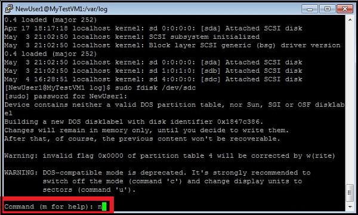
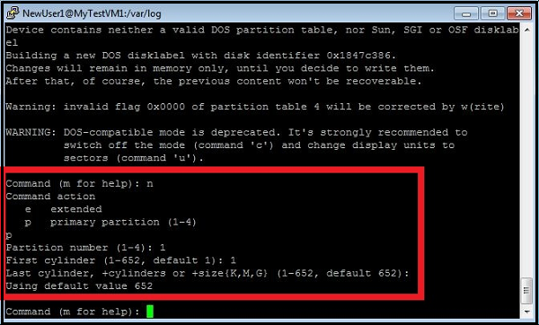
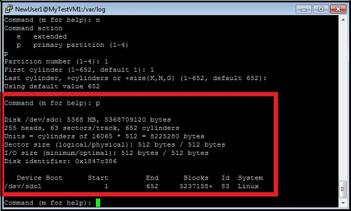
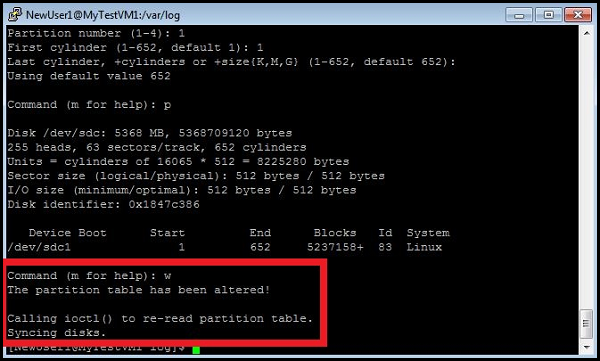
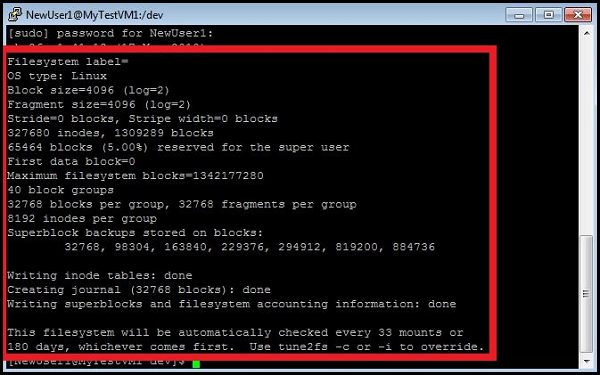

# Nominatim Install On Azure Ubuntu 14.04 VMs

This tutorial will allow anyone to install a Nominatim server on an Azure Virtual Machine.
It is based on multiple turorial and ressources found online. 


### Step1: Creation of the virtual machine
In the azure portal:
Create Virtual Machine: Ubuntu Server 14.04 LTS

* Hostname: axageocoding
* Username: azureusuer
* Password: ********
* Pricing Tier: G3
* Location: West US

This machine is recommended when a full planet install is desired. It has 8 cores and 112GB of RAMs and will allow a faster install of the server. 

Then we need to add a data disk:
Click disks -> Attach New 
Leave the default Disk file name and set the appropriate Size:

* Size = 1023 GB

Now that this is done, we need to initialize the disk on the machine

### Step2: Initialization of the data disk

We will follow the following tutorials:

1. [Install Azure CLI](https://azure.microsoft.com/en-us/documentation/articles/xplat-cli-install/)
2. [Initialize Disk](https://azure.microsoft.com/en-us/documentation/articles/virtual-machines-linux-how-to-attach-disk/)

#### Install node.js and npm on Linux distributions that use dpkg package management

The most common of these distributions use either the advanced packaging tool (apt) or other tools based on the .deb package format. Some examples are Ubuntu and Debian.
Most of the more recent of these distributions require installing nodejs-legacy in order to get a properly configured npm tool to install the Azure CLI. The following code shows the commands that install npm properly on Ubuntu 14.04.
```{r, eval = F}
sudo apt-get install nodejs-legacy
sudo apt-get install npm
sudo npm install -g azure-cli
```

Then you need to login and configure your subscription:
```{r, eval = F}
azure login azureuser
```
It will ask you to connect to the following website and enter a code: aka.ms/devicelogin
It will allow you to properly connect to the right subscription 

After this is done you should check that you can see the VMs:
```{r, eval = F}
$azure vm disk list
info:    Executing command vm disk list
+ Fetching disk images
data:    Name                                          OS
data:    --------------------------------------------  -----
  data:    myTestVhd                                     Linux
data:    ubuntuVMasm-ubuntuVMasm-0-201508060029150744  Linux
data:    ubuntuVMasm-ubuntuVMasm-0-201508060040530369
info:    vm disk list command OK
```

Next you need to find the device identifier for the data disk to initialize. In the SSH window, type the following command, and then enter the password for the account that you created to manage the virtual machine: sudo grep SCSI /var/log/syslog
In the SSH window, type the following command to create a new device, and then enter the account password:

```{r, eval = F}
sudo fdisk /dev/sdc
```
1.	When prompted, type n to create a new partition.



2.	When prompted, type p to make the partition the primary partition, type 1 to make it the first partition, and then type enter to accept the default value for the cylinder.



3.	Type p to see the details about the disk that is being partitioned.



4.	Type w to write the settings for the disk.



5.	Make the file system on the new partition. As an example, type the following command and then enter the account password:

```{r, eval=F}
sudo mkfs -t ext4 /dev/sdc1
```



6.	Make a directory to mount the new file system. As an example, type the following command and then enter the account password:
```{r, eval = F}
sudo mkdir /datadrive
```
7.	Type the following command to mount the drive:
```{r, eval = F}
sudo mount /dev/sdc1 /datadrive
```
The data disk is now ready to use as /datadrive.

8.	Add the new drive to /etc/fstab:

To ensure the drive is re-mounted automatically after a reboot it must be added to the /etc/fstab file. In addition, it is highly recommended that the UUID (Universally Unique IDentifier) is used in /etc/fstab to refer to the drive rather than just the device name (i.e. /dev/sdc1). To find the UUID of the new drive you can use the blkid utility:
```{r, eval = F}
sudo -i blkid
```
The output will look similar to the following:
```{r, eval = F}
/dev/sda1: UUID="11111111-1b1b-1c1c-1d1d-1e1e1e1e1e1e" TYPE="ext4"
/dev/sdb1: UUID="22222222-2b2b-2c2c-2d2d-2e2e2e2e2e2e" TYPE="ext4"
/dev/sdc1: UUID="33333333-3b3b-3c3c-3d3d-3e3e3e3e3e3e" TYPE="ext4"
```

Next, open the /etc/fstab file in a text editor. Note that /etc/fstab is a system file, so you will need to use sudo to edit this file, for example:
```{r, eval = F}
sudo vi /etc/fstab
```
In this example we will use the UUID value for the new /dev/sdc1 device that was created in the previous steps, and the mountpoint/datadrive. Add the following line to the end of the /etc/fstab file:
```{r, eval = F}
UUID=33333333-3b3b-3c3c-3d3d-3e3e3e3e3e3e   /datadrive   ext4   defaults   1   2
```
You can now test that the file system is mounted properly by simply unmounting and then re-mounting the file system, i.e. using the example mount point /datadrive created in the earlier steps:
```{r, eval = F}
sudo umount /datadrive
sudo mount /datadrive
```
If the mount command produces an error, check the /etc/fstab file for correct syntax. If additional data drives or partitions are created you will need to enter them into /etc/fstab separately as well.

Now that the disk is properly setup, we can start the installation of Nominatim on the VM. 

### Step3: Install Nominatim on Linux VM
We will be following this [tutorial](http://koo.fi/blog/2015/03/19/openstreetmap-nominatim-server-for-geocoding/).

#### Sofware requirements
As root you need to install the following softwares.
```{r, eval = F}
sudo su
```

##### PostgreSQL with PostGIS extension:
```{r, eval = F}
sudo apt-get install \
postgresql postgis postgresql-contrib \
postgresql-server-dev-9.3 postgresql-9.3-postgis-2.1 \
postgresql-doc-9.3 postgis-doc
```
##### Apache with PHP5:

```{r, eval = F}
sudo apt-get install \
apache2 php5 php-pear php5-pgsql php5-json php-db
```

##### Git and various tools:

```{r, eval = F}
sudo apt-get install \
wget git autoconf-archive build-essential \
automake gcc proj-bin
```
##### Tool for handling OpenStreetMap data:
```{r, eval = F}
sudo apt-get install osmosis
```

##### Needed libraries:

```{r, eval = F}
sudo apt-get install \
libxml2-dev libgeos-dev libpq-dev libbz2-dev libtool \
automake libproj-dev libboost-dev libboost-system-dev \
libboost-filesystem-dev libboost-thread-dev \
libgeos-c1 libgeos++-dev lua5.2 liblua5.2-dev \
libprotobuf-c0-dev protobuf-c-compiler
```

#### Move database to datadrive

As the database is very large, we do not want to store it on the OS drive but on the datadrive. 
Therefore, we need to configure the postgreSQL to have it store and search on the datadrive. 
We will follow this [tutorial](http://www.whiteboardcoder.com/2012/04/change-postgres-datadirectory-folder.html) to do that. 


First determine where the current data_directory is (the database folder)


Log in as the postgres user and log into the current database.  
Use the show data_directory(); to see where the current data_directory is.
Log out of the postgres user

```{r, eval = F}
sudo su postgres
psql -d postgres 
select version();
SHOW data_directory;
\q
exit
```


After a fresh install of postgres 9.3  the data_directory was at:
*/var/lib/postgresql/9.3/main/postgresql.conf*

In our case, the hard drive is mounted at /datadrive.
Let's create a subdirectory *postgresqldata* to place the DB in, then set its owner as postgres. 
Then,  we run the initdb  program as the postgres user.

```{r, eval = F}
sudo su root
mkdir -p /datadrive/postgresqldata
chown -R postgres:postgres /datadrive/postgresqldata
su postgres

/usr/lib/postgresql/9.3/bin/initdb -D /datadrive/postgresqldata
exit
```

Now edit postgressql.conf
Open it up for editing
```{r, eval = F}
sudo vi +41 /etc/postgresql/9.3/main/postgresql.conf
```

Change

```{r, eval = F}
data_directory = '/var/lib/postgresql/9.1/main/'
```


To
```{r, eval = F}
data_directory = '/database/postgresqldata/'
```


Kill the running postgres process and restart it
```{r, eval = F}
sudo pkill -u postgres
sudo /etc/init.d/postgresql restart
```


After it restarts log into the db and check the data_directory location and Start postgres

```{r, eval = F}
sudo /etc/init.d/postgresql start
sudo su postgres
psql -d postgres –U postgres
SHOW data_directory;
```

#### PostgreSQL tuning

The following directives were set in /etc/postgresql/9.3/main/postgresql.conf:

```{r, eval = F}
shared_buffers                = 2048MB
work_mem                      = 50MB
maintenance_work_mem          = 1024M
fsync                         = off    # dangerous!
synchronous_commit            = off
full_page_writes              = off    # dangerous!
checkpoint_segments           = 100
checkpoint_timeout            = 10min
checkpoint_completion_target  = 0.9
effective_cache_size          = 2048M
```
The buffer and memory values depend on your available RAM so you should set sane values accordingly.  These are good for 4 GB RAM.

There are two truly dangerous settings here. Setting fsync off will cause PostgreSQL to report successful commits before the disk has confirmed the data has been written successfully. Setting full_page_writes off exposes the database to the possibility of partially updated data in case of power failure. These options are used here only for the duration of the initial import, because setting them so makes the import much faster. Fsync and full page writes must be turned back on after the import to ensure database consistency.

The synchronous_commit also jeopardizes the durability of committed transactions by reporting successful commits to clients asynchronously, meaning that the transaction may not have been fully written to disk. It does not compromize  consistency as the two previous directives discussed. It just means that in the case of power failure, some recent transactions that were already reported to the client as having been committed, may in fact be aborted and rolled back. The database will still be in a consistent state. We’ll leave it off because it speeds up the queries, and we don’t really care about it in this database. We can always rebuild it from scratch. But if you have other important databases in the same database cluster, I would recommend turning it back on as well, since the setting is cluster-wide.

The maintenance_work_mem will also be reduced to a lower value later, after the import.

Restart PostgreSQL to apply changes:

```{r, eval = F}
pg_ctlcluster 9.3 main restart
```


#### Dedicated user
We’ll install the software under this user’s home directory (user id “azureuser”).


```{r, eval = F}
useradd -c 'OpenStreetMap Nominatim' -m -s /bin/bash azureuser
```

#### Database users
We will also make “azureuser” a database user, as well as the already created “www-data” (created by the apache2 package).

*Azureuser* will be a superuser and *www-data* will be a regular one.

This must be done as a database administrator. The “postgres” user by default is one (root is not). Change user:


```{r, eval = F}
su - postgres
```
If you do not know the password, do the following to reset it:
```{r, eval = F}
sudo passwd postgres
```
It will ask you for a new password. 

Create database users:
```{r, eval = F}
createuser -sdRe azureuser
createuser -SDRe www-data
exit
```

#### Download and Compile Nominatim
Su to user azureuser:

```{r, eval = F}
su - azureuser
```

Set some environment variables. We’ll use these later. These are the download locations for files and updates. Lines 3 and 4 below are for andorra Customize to your needs.

Also set the BASE_URL to point to your server and install directory. The last forward slash seems to be important.

```{r, eval = F}
WIKIPEDIA_ARTICLES="http://www.nominatim.org/data/wikipedia_article.sql.bin"
WIKIPEDIA_REDIRECTS="http://www.nominatim.org/data/wikipedia_redirect.sql.bin"
OSM_LATEST="http://download.geofabrik.de/europe/andorra-latest.osm.pbf"
OSM_UPDATES="http://download.geofabrik.de/europe/andorra-updates"
BASE_URL="http://axageocoding.cloudapp.net/nominatim/"
```
You can browse available areas at download.geofabrik.de.

##### Clone the Repository from Github

We will use the release 2.3 branch:

```{r, eval = F}
cd /datadrive/
  git clone --recursive \
https://github.com/twain47/Nominatim.git \
--branch release_2.3

cd Nominatim
```

The –recursive option is needed to clone everything, because the repository contains submodules.

##### Compile Nominatim

Simply:

```{r, eval = F}
./autogen.sh
./configure
make
```

If there were no errors, we are good. In case of missing libraries, check that you installed all requirements earlier.

##### Configure Local Settings

Some required settings should go to *~/Nominatim/settings/local.php*:

```{r, eval = F}
cat >settings/local.php <<EOF
<?php
// Paths
@define('CONST_Postgresql_Version', '9.3');
@define('CONST_Postgis_Version', '2.1');
@define('CONST_Website_BaseURL', '$BASE_URL');

// Update process
@define('CONST_Replication_Url', '$OSM_UPDATES');
@define('CONST_Replication_MaxInterval', '86400');
@define('CONST_Replication_Update_Interval', '86400');
@define('CONST_Replication_Recheck_Interval', '900');
?>EOF
```
The last four definitions are only required if you are going to do incremental updates.

#### Download Data
OpenStreetMap data (about 1 MB for Andorra):

```{r, eval = F}
wget -O data/latest.osm.pbf $OSM_LATEST
```

The OSM data is all that is really required. The rest below are optional.

Wikipedia data (about 1.4 GB):

```{r, eval = F}
wget -O data/wikipedia_article.sql.bin $WIKIPEDIA_ARTICLES
wget -O data/wikipedia_redirect.sql.bin $WIKIPEDIA_REDIRECTS
```

Special phrases for country codes and names (very small):

```{r, eval = F}
./utils/specialphrases.php --countries >data/specialphrases_countries.sql
```

Special search phrases (a few megabytes):
```{r, eval = F}
./utils/specialphrases.php --wiki-import >data/specialphrases.sql
```

Next we’ll import all this stuff into the database.

#### Import Data
The utils/setup.php will create a new database called “nominatim” and import the given .pbf file into it. This will take a long time depending on your PostgreSQL settings, available memory, disk speed and size of dataset. The full planet can take days to import on modern hardware. My small dataset took a bit over 30 min.

```{r, eval = F}
./utils/setup.php \
--osm-file data/latest.osm.pbf \
--all --osm2pgsql-cache 1024 2>&1 \
| tee setup.log
```
The messages will be saved into setup.log in case you need to look at them later.

If you had the Wikipedia data downloaded, the setup should have imported that automatically and told you about it. You can import the special phrases data if you downloaded it earlier using these commands:

```{r, eval = F}
psql -d nominatim -f data/specialphrases_countries.sql
psql -d nominatim -f data/specialphrases.sql
```

#### Database Production Settings

Now that the import is done, it is time to configure the database to settings that are suitable for production use. The following changes were made in */etc/postgresql/9.3/main/postgresql.conf*:

```{r, eval = F}
maintenance_work_mem          = 128M
fsync                         = on
full_page_writes              = on
```

You should also set the synchronous_commit directive to on if you have other databases running on this same database cluster. See the PostgreSQL Tuning section earlier in this post.

Apply changes:

```{r, eval = F}
pg_ctlcluster 9.3 main restart
```

#### Create the Web Site
The following commands have to be run as root.
```{r, eval = F}
sudo su
```
Create a directory to install the site into and set permissions:

```{r, eval = F}
mkdir /var/www/html/nominatim
chown nominatim:www-data /var/www/html/nominatim
chmod 755 /var/www/html/nominatim
chmod g+s /var/www/html/nominatim
```
Ask bots to keep out:

```{r, eval = F}
cat >/var/www/html/nominatim/robots.txt <<'EOF'
User-agent: *
  Disallow: /
  EOF
```

##### Apache configuration
You need to come back as a normal user:
```{r, eval = F}
exit
```

Edit the default site configuration file */etc/apache2/sites-enabled/000-default.conf* and make it look like something like below:

```{r, eval = F}
<VirtualHost *:80>
  ServerName axageocoding.cloudapp.net
ServerAdmin webmaster@cloudapp.net
DocumentRoot /var/www/html

ErrorLog ${APACHE_LOG_DIR}/error.log
CustomLog ${APACHE_LOG_DIR}/access.log combined

<Directory "/var/www/html/nominatim">
  Options FollowSymLinks MultiViews
AddType text/html .php
</Directory>
  </VirtualHost>
  
  ```
  
  Apply changes by restarting web server:
  
  ```{r, eval = F}
apache2ctl restart
```

##### Install the Nominatim Web Site

The installation should be done as the nominatim user:

```{r, eval = F}
su - azureuser
cd Nominatim
```
Run the setup.php with the option to create the web site:

```{r, eval = F}
./utils/setup.php --create-website /var/www/html/nominatim
```
At this point, the site is ready and you can point your browser to the base URL and try it out. It should look something like this: